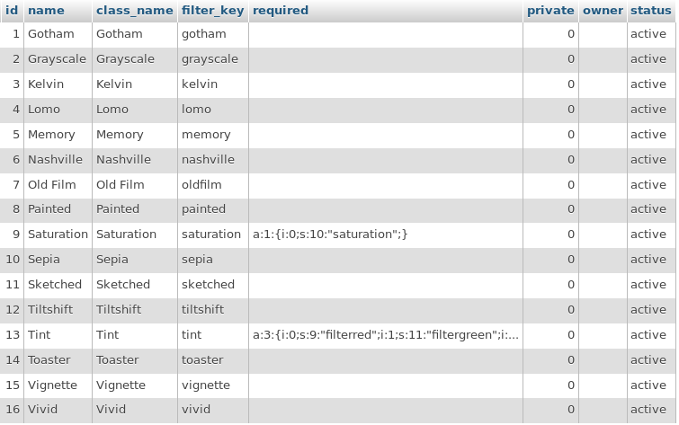
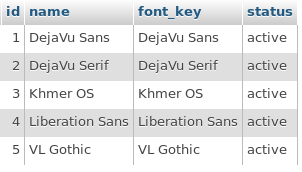
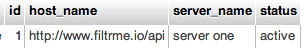
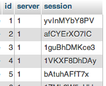

## Overview

Application servers do the heavy lifting of filtering the media. Setup is fairly complex and will take some trial and error to get things up and running smoothly. If using AWS, once you get a single application server setup perfectly it helps to create an AMI so launching new servers doesn't require any hair pulling to get FFmpeg, ImageMagick, and all necessary libraries setup and working in harmony.

All servers used were based on CentOS 6.4 setup as 'Web Server'.

## Software setup

### Versions

Package | Version
------------ | ------------- 
FFmpeg | N-52400-gf4596e8
ImageMagick | 6.8.4-10
PHP | 5.4.14

### Guide

- Follow guide at <https://ffmpeg.org/trac/ffmpeg/wiki/CentosCompilationGuide> to setup FFmpeg.-  **Stop before compiling FFmpeg at last step.**
- Before you compile FFmpeg you'll want to make sure you have all the required libraries. If you don't, you'll get compilation errors which do help tell you which libraries need to be installed. Here are some we found that we needed to install before compiling.
- Install AAC lib.

```
$ wget http://downloads.sourceforge.net/opencore-amr/vo-aacenc-0.1.1.tar.gz
$ tar xzvf vo-aacenc-0.1.1.tar.gz
$ cd vo-aacenc-0.1.1
$ ./configure --disable-shared
$ make
$ make install
```

- Install repository for libass as `/etc/yum.repos.d/linuxtech.repo` with contents

```
[linuxtech]
name=LinuxTECH
baseurl=http://pkgrepo.linuxtech.net/el6/release/
enabled=1
gpgcheck=1
gpgkey=http://pkgrepo.linuxtech.net/el6/release/RPM-GPG-KEY-LinuxTECH.NET
```	

- Install all libraries `$ yum install libass libass-devel libfaac libfaac-devel libtheora libtheora-devel libpng-devel`
- Compile FFmpeg using this to configure `$ ./configure --enable-gpl --enable-libmp3lame --enable-libtheora --enable-libvo-aacenc --enable-libvorbis --enable-libvpx --enable-libx264 --enable-version3 --enable-libfaac --enable-nonfree --enable-libfreetype --enable-libass`
- Install REMI and EPEL repositories

```
$ wget http://dl.fedoraproject.org/pub/epel/6/x86_64/epel-release-6-8.noarch.rpm
$ wget http://rpms.famillecollet.com/enterprise/remi-release-6.rpm
$ rpm -Uvh remi-release-6*.rpm epel-release-6*.rpm
```

- Enable repo in `/etc/yum.repos.d/remi.repo` set `enabled=1`
- `$ yum update`
- Install ImageMagick by following guide at <http://www.imagemagick.org/script/install-source.php#unix>. You'll want at least **libpng** and **libjpeg** installed for ImageMagick before installing. Add additional image formats as needed and recompile ImageMagick to use them. If you can't find libjpeg via yum, compile it from source after downloading from here, **jpegsrc.v9.tar.gz** <http://www.imagemagick.org/download/delegates/>.
- Make sure AllowOverride is set to allow rewrites from your html directory.
- Make any changes to post/upload max size.

## API setup

1. Upload contents of this directory to your webserver.
2. Make changes to AWS configuration to connect to your database.
3. Run through the following files and update any paths to services as needed.
	- /api/classes/API.class.php
	- /api/classes/FilterBase.class.php
	- /api/classes/FilterFactory.class.php
	- /cron/remove-expired-sessions.php
	- /worker/filter.worker.php
	
## Database Setup

Whether you decide to use Amazon's DynamoDB or not, here are the tables and columns needed by the API. Depending on how you setup your database, local or in the cloud, adjustments may be necessary in both `application-server` and `proxy-server`.

Filters |
------------ |
**id** : primary / hash key |
**name** : display name |
**class_name** : class name of filter extending FilterBase |
**filter_key** : reference key of filter to pass between API calls |
**required** : serialized array of filter requirements |
**private** : 1/0 boolean |
**owner** : API token of developer account if set to private |
**status** : active/inactive |



Fonts |
------------ |
**id** : primary / hash key |
**name** : display name |
**font_key** : reference key of system font |
**status** : active/inactive |



FilterServers |
------------ |
**id** : primary / hash key |
**host_name** : endpoint of filter server - http://example.com/api |
**server_name** : used for display, not used anywhere in API |
**status** : active/inactive |



Sessions |
------------ |
**id** : primary / hash key |
**server** : id reference of FilterServers |
**session** : unique session key |


	