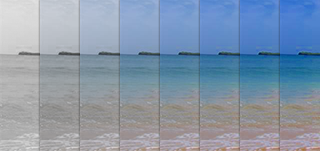
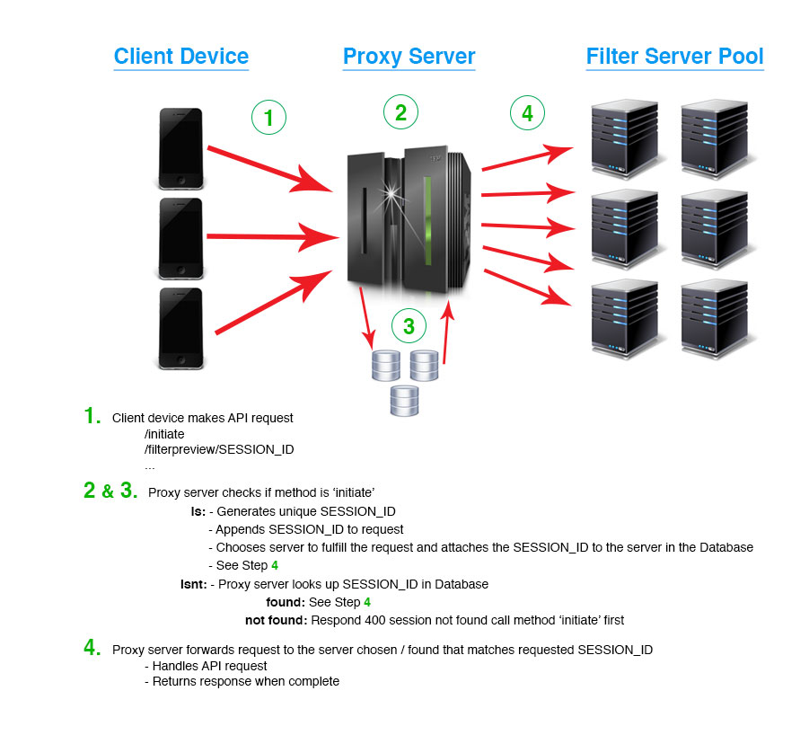
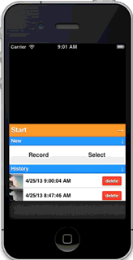

# PHP Media Filter API

## Overview

PHP Media Filter API is an SaaS application that uses PHP, FFmpeg, ImageMagick, and the Slim Framework (for the API) to give users the ability to manipulate videos and images on the go. 

The current implementation is integrated with [Mashape](https://www.mashape.com) and Amazon AWS. The Mashape API documentation configuration is also included for easy upload/setup under `resources`. Mashape is integrated to handle developer accounts / billing / etc. If you're attempting to run this for your own benfit, you can remove Mashape from the process with some modifications to `API.class.php` by changing the API token validation scheme. Currently it's based off of a Mashape specific header `X-Mashape-User`. AWS was used for the application and proxy servers as well as DynamoDB. 

We had this setup with a load balanced group of high-cpu 'proxy' servers that take all the requests and decide which high-i/o 'application' server will ultimatly handle the request. Each filter 'session' is tied to one application server, and it lives its entire life on that server. There's a cron included that runs each day to see which sessions have expired and removes them based on the expire time set in `API.class.php`.

Photo filtering is very straight forward. Takes uploaded media, makes a working copy, and applies the filter to the working copy. Video filtering is a bit more complex. The uploaded media is stored in its original format and a copy is made as the working copy. Currently there's a limit set to 480p (`API.class.php` line 338), so any down-sampling occurs on the original uploaded video and a new working copy is made. All rotations happen on the copy, the original is stored to revert changes. The video is then output as a sequencial series of images, one per frame, as lossless PNGs. As you're previewing the filters, the API is applying the filter to a single preview frame. Once you're happy and call the 'filter' method, the filter is then applied to each PNG. Once the filtering is complete, the images are recompiled into an h.264 MP4 with 96k AAC audio. Depending on the length of the video, the I/O of the server, and the complexity of the filter this could take anywhere from 1s to 1h. This method is non-blocking and a 'filter progress' method is available to check the progress of the job. That's a quick walk through, a sample of the request flow is provided at the bottom of this readme.

This was built with the idea of allowing developers to submit their own Filters to the API. The front-end for this was never completed and is not included. Filters have the ability to be private to each developer account, and can also require up to 6 additional values to be sent to the API call; red, green, blue, saturation, iteration, and total. Iteration and Total don't need to be sent via the API request, but if it's required, the values will be passed to the filter worker. Iteration is the current index of the image in the sequence to be filtered, and Total is the total number of images in the sequence.

Specific setup information is contained in a readme in both `application-server` and `proxy-server` directories. 

## Typical Filter Flow

An application will normally call /options to get all available filter properties when it starts up.

### Video

1. Call /video/initiate and post video to start session
2. Call /video/rotate/:session if a rotation is necessary
3. Call /video/filterpreview/:session to preview a filter on a single frame of the video
4. Gather extra filter properties such as video fade and overlay text
5. Call /video/filter/:session to start filter
6. Call /video/filterprogress/:session to get the progress of the filter job
7. Call /video/:session to get the final information of the filter session, like video locations, images, expire times, etc.

### Photo

1. Call /photo/initiate and post video to start session
2. Call /photo/rotate/:session of rotation is necessary
3. Call /photo/filter/:session to filter photo - instantaneous, no progess checks needed.


## API Endpoints

Currently implemented API endpoints are below.

Endpoint | Method | Description
------------ | ------------- | ------------
/options | GET  | Returns parameters used throughout the API. Lists all available and active filters along with their required parameters. Lists all available and active fonts used for overlaying text.
/photo/initiate | POST  | Initiates a filter session and responds with the session's unique identifier. The identifier is used throughout the API to determine which photo to complete the requested action on.
/photo/rotate/:id | POST  | Rotates the specified photo.
/photo/filter/:id | POST  | Filter the specified photo
/photo/:id | POST  | Returns information about a completed filter session.
/photo/:id | DELETE  | Deletes the specified photo session and all related files from the server. There is no undo to this so be careful!
/video/initiate | POST  | Initiates a filter session and responds with the session's unique identifier. The identifier is used throughout the API to determine which video to complete the requested action on.
/video/rotate/:id | POST  | Rotates the specified video. Depending how the video is shot, the perspective may not be what the user was expecting after upload. In most cases, rotating the video Clockwise will remedy that. 
/video/filterpreview/:id | POST  | Preview a filter on the specified video. Takes filter options and returns the location of the filtered preview image.
/video/filter/:id | POST  | Filters the specified video. This method is non-blocking so as soon as it returns as successful, it's then okay to start checking the progress of the filter job.
/video/filterprogress/:id | POST  | Checks the progress of the specified video session. Will return the current step, the total steps, the progress percent of the current step if one is supplied, and a message indicating where it is in the filter job.
/video/filtercancel/:id | POST  | Cancels the specified video's filter job if one is running.
/video/images/:id | POST  | Returns a list of the specified video's images.
/video/:id | POST | Returns information about a completed filter session. Preview images, filtered and original video URL, and some properties of the filtered video.
/video/:id | DELETE  | Deletes the specified video session and all related files from the server. There is no undo to this so be careful!
/calculatestorage/session/:id | POST | Returns total storage used by the specified session
/calculatestorage/account | POST  | Returns total storage used by developer account. **TODO** - reimplement with notion of developer's client sessions may span across multiple application servers.


## Filters

Original |
------------ |
 |

Gotham | Grayscale |
------------ | ------------- |
 |   |

Kelvin | Lomo |
------------ | ------------- |
 |   |

Memory | Nashville |
------------ | ------------- |
 |   |

Old Film | Painted |
------------ | ------------- |
 |   |

Saturation | Sepia |
------------ | ------------- |
 |   |

Sketched | Tilt Shift |
------------ | ------------- |
 |   |

Tint | Toaster |
------------ | ------------- |
 |   |

Vignette | Vivid |
------------ | ------------- |
 |   |

## Request flow

Below is an example of how requests flow through the Proxy to the application servers.



## Demo

Proof of concept app using the API to filter videos.



## Code Samples

### Rotate
```
function rotate(rotation){
	/*
		rotation:
			0 = 90d Counter Clockwise & Flip
			1 = 90d Clockwise
			2 = 90d Counter Clockwise
			3 = 90d Clockwise & Flip
	*/
	var xmlhttp = new XMLHttpRequest();
	xmlhttp.onreadystatechange = function(){
		if (xmlhttp.readyState == 4 && xmlhttp.status == 200){
			var response = eval('(' + xmlhttp.response + ')');
			if(response.success){
				// refresh preview of filter
				// 
				
				// if a filter has been applied already
				// re-apply the filter to the
				// newly rotated video. rotation happens
				// on the original upload
				if(selectedFilter != '') applyFilter(selectedFilter);
			} else {
				// read response.message
			}
		} else if (xmlhttp.readyState == 4 && xmlhttp.status == 403){
			var response = eval('(' + xmlhttp.response + ')');
			// read response.message && response.code
		} else if (xmlhttp.readyState == 4 && xmlhttp.status == 400){
			var response = eval('(' + xmlhttp.response + ')');
			// read response.message && response.code
		}
	}
	var params = {};
	params.rotation = rotation;
	xmlhttp.open('POST', API_SERVER + '/video/rotate/' + SESSION);
	xmlhttp.setRequestHeader('Content-type', 'application/x-www-form-urlencoded');
	xmlhttp.setRequestHeader('X-Mashape-Authorization', MASHAPE_AUTH);
	xmlhttp.send(objectToNameValuePairs(params));
}
```

### Preview Filter
```
function previewFilter(filter, filterred, filterblue, filtergreen, saturation){
	/*
		filterred = 0 - 255
		filterblue = 0 - 255
		filtergreen = 0 - 255
		saturation = -100 - 100
	*/
	var xmlhttp = new XMLHttpRequest();
	xmlhttp.onreadystatechange = function(){
		if (xmlhttp.readyState == 4 && xmlhttp.status == 200){
			var response = eval('(' + xmlhttp.responseText + ')');
			if(response.success){
				// refresh preview of filter
				// 
			} else {
				//read response.message
			}
		} else if (xmlhttp.readyState == 4 && xmlhttp.status == 403){
			var response = eval('(' + xmlhttp.response + ')');
			// read response.message && response.code
		} else if (xmlhttp.readyState == 4 && xmlhttp.status == 400){
			var response = eval('(' + xmlhttp.response + ')');
			// read response.message && response.code
		}
	}
	var params = {};
	params.filter = filter;
	params.filterred = filterred;
	params.filterblue = filterblue;
	params.filtergreen = filtergreen;
	params.saturation = saturation;
	xmlhttp.open('POST', API_SERVER + '/video/filterpreview/' + SESSION);
	xmlhttp.setRequestHeader('Content-type', 'application/x-www-form-urlencoded');
	xmlhttp.setRequestHeader('X-Mashape-Authorization', MASHAPE_AUTH);
	xmlhttp.send(objectToNameValuePairs(params));
}
```

### Start Filter
```
function doFilter(){
	/*
		fade:
			none = No Fade
			fadein = Fade In
			fadeout = Fade Out
			fadeboth = Fade In and Out
		overlaytextposition:
			8 = Top
			5 = Middle
			2 = Bottom
	*/
	var xmlhttp = new XMLHttpRequest();
	xmlhttp.onreadystatechange = function(){
		if (xmlhttp.readyState == 4 && xmlhttp.status == 200){
			var response = eval('(' + xmlhttp.responseText + ')');
			if(response.success){
				// session is filtering
				// start to check progress of filter job
				// can clear all settings and start
				// a new session while others are filtering
			} else {
				// read response.message
			}
		} else if (xmlhttp.readyState == 4 && xmlhttp.status == 403){
			var response = eval('(' + xmlhttp.response + ')');
			// read response.message && response.code
		} else if (xmlhttp.readyState == 4 && xmlhttp.status == 400){
			var response = eval('(' + xmlhttp.response + ')');
			// read response.message && response.code
		}
	}
	var params = {};
	params.filter = filter;
	params.filterred = filterred;
	params.filterblue = filterblue;
	params.filtergreen = filtergreen;
	params.saturation = saturation;
	params.fade = fade;
	if(overlayText != ''){
		params.overlaytext = overlayText;
		params.overlayfont = font;
		params.overlayfontcolor = 'FFFFFF';
		params.overlayfontsize = '40';
		params.overlayfontbordersize = '0';
		params.overlayfontbordercolor = '000000';
		params.overlayshadowsize = '1';
		params.overlayshadowcolor = '000000';
		params.overlaytextstart = overlayTextFadeIn;
		params.overlaytextend = overlayTextFadeOut;
		params.overlaytextposition = textPosition;
	}
	xmlhttp.open('POST', API_SERVER + '/video/filter/' + SESSION);
	xmlhttp.setRequestHeader('Content-type', 'application/x-www-form-urlencoded');
	xmlhttp.setRequestHeader('X-Mashape-Authorization', MASHAPE_AUTH);
	xmlhttp.send(objectToNameValuePairs(params));
}
```

### Filter Progress Check
```
function startProgressCheck(session){
	progress_checks[session] = new XMLHttpRequest();
	progress_checks[session].open('POST', API_SERVER + '/video/filterprogress/' + session, true);
	progress_checks[session].onreadystatechange=function() {
		if (progress_checks[session].readyState == 4 && progress_checks[session].status == 200) {
			var response = eval('(' + progress_checks[session].responseText + ')');
			if(response.success && progressResponse.step != null){
				if(response.step < response.steps){
					// keep checking progress
				} else if(response.step == response.steps){
					// filtering is complete
				}
			} else if(!response.success && response.code){
				// read response.message &&  response.code
			} else {
				// job may not have started yet
				// keep checking progress
			}
		} else if (progress_checks[session].readyState == 4 && progress_checks[session].status == 403){
			var response = eval('(' + progress_checks[session].response + ')');
			// read response.message && response.code
		} else if (progress_checks[session].readyState == 4 && progress_checks[session].status == 400){
			var response = eval('(' + progress_checks[session].response + ')');
			// read response.message && response.code
		}
	}
	progress_checks[session].setRequestHeader('Content-type', 'application/x-www-form-urlencoded');
	progress_checks[session].setRequestHeader('X-Mashape-Authorization', MASHAPE_AUTH);
	progress_checks[session].send(null);
}
```

### Video Information
```
function getVideoInformation(session) {
	var xmlhttp = new XMLHttpRequest();
	xmlhttp.open('POST', API_SERVER + '/video/' + session, true);
	xmlhttp.onreadystatechange = function() {
		if (xmlhttp.readyState == 4 && xmlhttp.status == 200) {
			var response = eval('(' + xmlhttp.responseText + ')');
			if(response.code == 8){
				// session exists, but a
				// filtered video wasn't found
				// update preview with preview image
				// 
			} else {
				// filtered video found
				// update view with video
				// <video controls="controls" poster="' + response.preview_images[3] + '"> <source src="' + response.video_url_filtered + '" /></video>
			}
		} else if (xmlhttp.readyState == 4 && xmlhttp.status == 403){
			var response = eval('(' + xmlhttp.response.response+ ')');
			// read response.message && response.code
		} else if (xmlhttp.readyState == 4 && xmlhttp.status == 400){
			var response = eval('(' + xmlhttp.response+ ')');
			if(response.code == 8){
				// session exists, but a
				// filtered video wasn't found
				// update preview with preview image
				// 
			} else {
				// read response.message && response.code
			}
		}
	}
	xmlhttp.setRequestHeader('Content-type', 'application/x-www-form-urlencoded');
	xmlhttp.setRequestHeader('X-Mashape-Authorization', MASHAPE_AUTH);
	xmlhttp.send(null);
}
```

### Delete Video
```
function deleteVideoSession(session) {
	var xmlhttp = new XMLHttpRequest();
	xmlhttp.open('DELETE', API_SERVER + '/video/' + session, true);
	xmlhttp.onreadystatechange = function() {
		if (xmlhttp.readyState == 4 && xmlhttp.status == 200){
			// deleted
		} else if (xmlhttp.readyState == 4 && xmlhttp.status == 403){
			var response = eval('(' + xmlhttp.response + ')');
			// read response.message && response.code
		} else if (xmlhttp.readyState == 4 && xmlhttp.status == 400){
			var response = eval('(' + xmlhttp.response + ')');
			// read response.message && response.code
		}
	}
	xmlhttp.setRequestHeader('Content-type', 'application/x-www-form-urlencoded');
	xmlhttp.setRequestHeader('X-Mashape-Authorization', MASHAPE_AUTH);
	xmlhttp.send(null);
}
```

## License
Copyright (c) 2013, e-works media, inc.
All rights reserved.

Redistribution and use in source and binary forms, with or without modification, are permitted provided that the following conditions are met:

- Redistributions of source code must retain the above copyright notice, this list of conditions and the following disclaimer.
- Redistributions in binary form must reproduce the above copyright notice, this list of conditions and the following disclaimer in the documentation and/or other materials provided with the distribution.
- Neither the name of e-works media, inc. nor the names of its contributors may be used to endorse or promote products derived from this software without specific prior written permission.

THIS SOFTWARE IS PROVIDED BY THE COPYRIGHT HOLDERS AND CONTRIBUTORS "AS IS" AND ANY EXPRESS OR IMPLIED WARRANTIES, INCLUDING, BUT NOT LIMITED TO, THE IMPLIED WARRANTIES OF MERCHANTABILITY AND FITNESS FOR A PARTICULAR PURPOSE ARE DISCLAIMED. IN NO EVENT SHALL THE COPYRIGHT HOLDER OR CONTRIBUTORS BE LIABLE FOR ANY DIRECT, INDIRECT, INCIDENTAL, SPECIAL, EXEMPLARY, OR CONSEQUENTIAL DAMAGES (INCLUDING, BUT NOT LIMITED TO, PROCUREMENT OF SUBSTITUTE GOODS OR SERVICES; LOSS OF USE, DATA, OR PROFITS; OR BUSINESS INTERRUPTION) HOWEVER CAUSED AND ON ANY THEORY OF LIABILITY, WHETHER IN CONTRACT, STRICT LIABILITY, OR TORT (INCLUDING NEGLIGENCE OR OTHERWISE) ARISING IN ANY WAY OUT OF THE USE OF THIS SOFTWARE, EVEN IF ADVISED OF THE POSSIBILITY OF SUCH DAMAGE.
